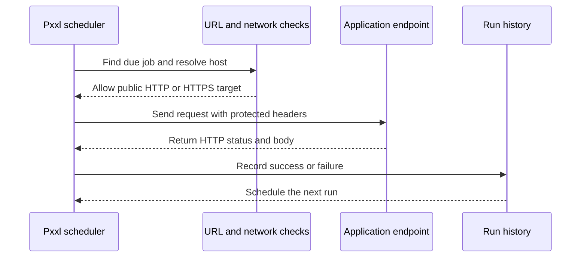

The worker checks for due jobs every 30 seconds and can run up to 20 jobs at the same time.

## One run

1. The worker finds an active job whose next run is due.
2. It claims the run and calculates the next run time.
3. It sends one HTTP request with the configured method and headers.
4. A <code>2xx</code> response is recorded as **Success**.
5. Other responses, network errors, and timeouts are recorded as **Failed**.
6. Run history keeps at most 10 KB of the response body.

Every scheduled run is one HTTP attempt. A manual trigger is queued by the same worker and appears in the same run history.

## URL safety

Pxxl validates the address when you create or edit a job, then checks it again when the worker connects.

- The URL must be absolute and use <code>http</code> or <code>https</code>.
- Localhost, loopback, private network, link-local, metadata, shared, multicast, and reserved addresses are blocked.
- DNS is resolved again at connection time so a hostname cannot change into a private address after validation.
- The URL test uses <code>HEAD</code> first and falls back to <code>GET</code> when needed.

## Run flow

The endpoint must be reachable from the public internet. A public URL should still require a token, signature, or another server-side check.
