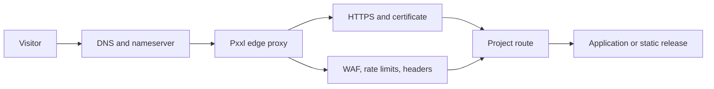

The **Routing** section decides which project receives requests after DNS resolves to Pxxl.

## Connect a project

<Steps>
  <Step title="Choose the project">
    Open the domain settings, select the project that should receive traffic, and save the connection.
  </Step>
  <Step title="Check the application port">
    Confirm the project listens on the port configured for its deployment.
  </Step>
  <Step title="Resync the proxy">
    Select **Resync Proxy** so the active edge route receives the saved project and port configuration.
  </Step>
  <Step title="Test the hostname">
    Open the canonical hostname and check [Monitoring](/domains/monitoring) for the request.
  </Step>
</Steps>

## Subdomains

The **Subdomains** section creates managed subdomains for eligible Pxxl-purchased domains and attaches them to projects. For an external domain, create the subdomain from the project domain controls and add the record at the external DNS provider.

## Edge proxy controls

| Control | What it does |
| --- | --- |
| **Require HTTPS** | Redirects or rejects insecure traffic. |
| **Canonical host** | Keeps the apex or <code>www</code> hostname as the preferred address. |
| **WebSockets** | Allows upgrade requests for real-time connections. |
| **Security headers** | Adds baseline browser security headers. |
| **Maintenance mode** | Returns a controlled maintenance response. |
| **Method and network rules** | Allows or blocks HTTP methods, IP ranges, or countries. |
| **Request and response headers** | Adds headers at the edge. |
| **Rate limiting** | Limits requests by IP, host, or route. |
| **WAF rules** | Blocks common path traversal, SQL injection, and XSS patterns. |
| **Circuit breaker** | Pauses upstream traffic after repeated failures. |
| **In-flight limit** | Caps concurrent requests to a route. |
| **Upstream retries** | Retries temporary <code>502</code>, <code>503</code>, and <code>504</code> responses when enabled. |

Save proxy settings, then select **Resync Proxy**. Resync publishes the saved configuration to the active edge route. It does not rebuild the project.

## Request flow

