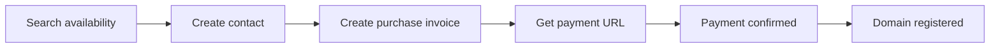

## Domain purchase flow



## Search domains

`POST /domains/search`

<ParamField body="query" type="string" required>
  Full domain or search term.
</ParamField>

<ParamField body="type" type="string">
  Optional TLD category.
</ParamField>

```bash
curl --request POST \
  https://server.pxxl.app/api/v3/domains/search \
  --header "Content-Type: application/json" \
  --data '{"query":"pxxl.cv"}'
```

```json
{
  "query": "pxxl.cv",
  "count": 1,
  "latency": 84,
  "cached": false,
  "results": [
    {
      "domain": "pxxl.cv",
      "available": true,
      "isPremium": false,
      "tld": ".cv",
      "registerDollar": 19,
      "registerNaira": 30000,
      "renewDollar": 19,
      "minimumPeriod": 1,
      "maxDuration": 10
    }
  ]
}
```

### Search and catalog endpoints

| Method | Path | Parameters | Returns |
| --- | --- | --- | --- |
| `POST` | `/domains/search` | `query`, `type?` | Search results and pricing |
| `POST` | `/domains/check-availability` | `domain` | Availability detail |
| `GET` | `/domains/tlds` | None | `{ tlds, count }` |
| `GET` | `/domains/tlds/search` | `q` | Matching TLDs |
| `GET` | `/domains/tlds/popular` | None | Popular TLDs |
| `GET` | `/domains/tlds/{tld}` | TLD name | TLD detail |
| `GET` | `/domains/types` | None | TLD categories |
| `GET` | `/domains/types/{type}/tlds` | Category | Matching TLDs |
| `POST` | `/domains/dns/lookup` | `domain`, `type?` | DNS records and nameservers |
| `POST` | `/domains/dns/bulk-lookup` | `domains[]` | Results keyed by domain |
| `POST` | `/domains/verify-registration` | `domain` | Registration verification |
| `GET` | `/cli/domains/addons` | `type?` | `{ addons, count }` |
| `GET` | `/cli/domains/addons/{addonId}` | Add-on ID | `{ addon }` |

## Create a registrant contact

`POST /cli/contacts`

<ParamField body="firstName" type="string" required>
  Registrant first name.
</ParamField>

<ParamField body="lastName" type="string" required>
  Registrant last name.
</ParamField>

<ParamField body="email" type="string" required>
  Registrant email.
</ParamField>

<ParamField body="phone" type="string" required>
  Registrant phone number.
</ParamField>

<ParamField body="address1" type="string" required>
  Primary street address.
</ParamField>

<ParamField body="city" type="string" required>
  City.
</ParamField>

<ParamField body="state" type="string" required>
  State or region.
</ParamField>

<ParamField body="postalCode" type="string" required>
  Postal code.
</ParamField>

<ParamField body="country" type="string" required>
  Country code.
</ParamField>

```bash
curl --request POST \
  https://server.pxxl.app/api/v3/cli/contacts \
  --header "Authorization: Bearer $PXXL_API_KEY" \
  --header "Content-Type: application/json" \
  --data '{"firstName":"Robin","lastName":"Developer","email":"robin@example.com","phone":"+2348000000000","address1":"1 Example Street","city":"Lagos","state":"Lagos","postalCode":"100001","country":"NG"}'
```

```json
{
  "contact": {
    "id": 248,
    "firstName": "Robin",
    "lastName": "Developer",
    "email": "robin@example.com",
    "phone": "+2348000000000",
    "address1": "1 Example Street",
    "city": "Lagos",
    "state": "Lagos",
    "postalCode": "100001",
    "country": "NG",
    "createdAt": "2026-08-17T08:00:00Z"
  }
}
```

### Contact endpoints

| Method | Path | Body | Returns |
| --- | --- | --- | --- |
| `POST` | `/cli/contacts` | Contact fields above | `{ contact }` |
| `GET` | `/cli/contacts` | None | `{ contacts, count }` |
| `GET` | `/cli/contacts/{contactId}` | None | `{ contact }` |
| `PUT` | `/cli/contacts/{contactId}` | Editable contact fields | `{ contact }` |
| `DELETE` | `/cli/contacts/{contactId}` | None | Empty successful response |

## Create a domain purchase

`POST /cli/domainprovider/domain/register`

<ParamField body="domains" type="array" required>
  Domains to purchase.
</ParamField>

<ParamField body="domains[].domainName" type="string" required>
  Full domain name.
</ParamField>

<ParamField body="domains[].years" type="number" default="1">
  Registration duration.
</ParamField>

<ParamField body="domains[].addons" type="array">
  Add-ons as `{ id }` objects.
</ParamField>

<ParamField body="domains[].nameservers" type="string[]">
  Optional custom nameservers.
</ParamField>

<ParamField body="contactId" type="string | number">
  Existing registrant contact.
</ParamField>

<ParamField body="contact" type="object">
  Inline registrant contact when `contactId` is omitted.
</ParamField>

<ParamField body="address" type="object">
  Inline registrant address.
</ParamField>

<ParamField body="currency" type="NGN | USD" default="NGN">
  Checkout currency.
</ParamField>

<ParamField body="teamId" type="string">
  Owning team.
</ParamField>

```bash
curl --request POST \
  https://server.pxxl.app/api/v3/cli/domainprovider/domain/register \
  --header "Authorization: Bearer $PXXL_API_KEY" \
  --header "Content-Type: application/json" \
  --data '{"contactId":248,"domains":[{"domainName":"example.com","years":1}],"currency":"USD"}'
```

```json
{
  "error": false,
  "data": {
    "invoiceId": "inv_123",
    "invoice": {
      "id": "inv_123",
      "status": "pending",
      "currency": "USD",
      "grandTotal": 19,
      "expiresAt": "2026-08-18T08:00:00Z"
    },
    "computedTotal": 19,
    "taxAmount": 0,
    "grandTotal": 19,
    "currency": "USD",
    "domains": [{ "domainName": "example.com", "years": 1 }],
    "domainErrors": []
  }
}
```

<Note>
  Search again immediately before purchase. Availability and pricing can change.
</Note>

## Get a payment URL

`GET /cli/domainprovider/invoice/{invoiceId}/payment-url`

<ParamField query="currency" type="NGN | USD">
  Checkout currency.
</ParamField>

<ParamField query="teamId" type="string">
  Owning team.
</ParamField>

```bash
curl "https://server.pxxl.app/api/v3/cli/domainprovider/invoice/inv_123/payment-url?currency=USD" \
  --header "Authorization: Bearer $PXXL_API_KEY"
```

```json
{
  "data": {
    "paymentUrl": "https://checkout.example/pxxl/inv_123",
    "checkoutUrl": "https://checkout.example/pxxl/inv_123",
    "reference": "pxxl_inv_123",
    "invoiceId": "inv_123",
    "currency": "USD",
    "paymentUrlExpiresAt": "2026-08-18T08:00:00Z"
  }
}
```

## Connect a domain

`POST /cli/domains`

<ParamField body="domain" type="string" required>
  Hostname to connect.
</ParamField>

<ParamField body="projectId" type="string" required>
  Project receiving traffic.
</ParamField>

<ParamField body="serviceAlias" type="string">
  Service target for a multi-service project.
</ParamField>

<ParamField body="servicePort" type="number">
  Explicit target port.
</ParamField>

<ParamField body="alias" type="boolean" default="false">
  Marks this hostname as an alias.
</ParamField>

<ParamField query="teamId" type="string">
  Owning team.
</ParamField>

```bash
curl --request POST \
  https://server.pxxl.app/api/v3/cli/domains \
  --header "Authorization: Bearer $PXXL_API_KEY" \
  --header "Content-Type: application/json" \
  --data '{"domain":"api.example.com","projectId":"proj_123","serviceAlias":"api"}'
```

```json
{
  "error": false,
  "domainId": "dom_123",
  "domain": { "name": "api.example.com", "status": "pending_dns" },
  "serviceAlias": "api",
  "expectedARecordIp": "203.0.113.10",
  "routeStatus": "pending"
}
```

## Connected domain endpoints

| Method | Path | Parameters | Returns |
| --- | --- | --- | --- |
| `GET` | `/cli/domains` | `teamId?` | Managed domain collection |
| `POST` | `/cli/domains` | Connection body above | Connected domain result |
| `GET` | `/cli/domains/{domain}` | `teamId?` | Domain detail |
| `PATCH` | `/cli/domains/{domain}` | HTTPS, websocket, project, and proxy settings | Updated domain |
| `DELETE` | `/cli/domains/{domain}` | `projectId?`, `teamId?` | Disconnect result |
| `GET` | `/cli/domains/{domain}/check` | `teamId?` | Availability or connection check |
| `GET` | `/cli/domains/{domain}/stats` | `timeframe?`, `teamId?` | Domain analytics |
| `POST` | `/cli/domains/checkrecord` | `domain`, `projectId`, `teamId?` | DNS verification |
| `POST` | `/cli/domains/{domain}/resync` | `teamId?` | Proxy and SSL resync result |
| `GET` | `/cli/domains/{domain}/zone-status` | `teamId?` | Managed zone state |
| `POST` | `/cli/domains/{domain}/activate` | `teamId?` | Activation result |
| `GET` | `/cli/domains/{domain}/certificate/download` | `teamId?` | Binary certificate bundle |

## DNS records

<ParamField body="type" type="string" required>
  Record type such as `A`, `AAAA`, `CNAME`, `TXT`, or `MX`.
</ParamField>

<ParamField body="name" type="string" required>
  Record name. Use `@` for the apex.
</ParamField>

<ParamField body="value" type="string" required>
  Record value.
</ParamField>

<ParamField body="ttl" type="number">
  Time to live in seconds.
</ParamField>

<ParamField body="priority" type="number">
  Priority for records such as `MX`.
</ParamField>

```bash
curl --request POST \
  https://server.pxxl.app/api/v3/cli/domains/dom_123/dns-records \
  --header "Authorization: Bearer $PXXL_API_KEY" \
  --header "Content-Type: application/json" \
  --data '{"type":"A","name":"@","value":"203.0.113.10","ttl":300}'
```

```json
{
  "error": false,
  "records": [
    { "id": "rec_123", "type": "A", "name": "@", "value": "203.0.113.10", "ttl": 300 }
  ]
}
```

| Method | Path | Body | Returns |
| --- | --- | --- | --- |
| `GET` | `/cli/domains/{domain}/dns-records` | None | DNS record collection |
| `POST` | `/cli/domains/{domain}/dns-records` | One record | Updated records |
| `PUT` | `/cli/domains/{domain}/dns-records` | `recordId?` or `records[]` | Replaced records |
| `DELETE` | `/cli/domains/{domain}/dns-records` | `recordId`, `zoneId?` | Updated records or action result |
| `GET` | `/cli/domains/{domain}/dns-change-logs` | None | DNS change history |
| `POST` | `/cli/domains/{domain}/dns-change-logs/{logId}/rollback` | Empty object | Restored records |
| `POST` | `/cli/domains/{domain}/nameservers` | `nameservers[]` | Nameserver state |
| `POST` | `/cli/domains/{domain}/nameservers/reset` | Empty object | Default nameserver state |
| `POST` | `/cli/domains/{domain}/nameservers/verify` | Empty object | Verification result |

## Invoice and order endpoints

| Method | Path | Parameters | Returns |
| --- | --- | --- | --- |
| `POST` | `/cli/domain-orders` | `domains[]`, `contactId?` | Domain order |
| `GET` | `/cli/domain-orders` | None | `{ orders, count }` |
| `GET` | `/cli/domain-orders/{orderId}` | Order ID | Order detail |
| `PUT` | `/cli/domain-orders/domains/{domainId}/duration` | `duration` | Updated order domain |
| `POST` | `/cli/domain-orders/domains/{domainId}/addons` | `addonIds[]` | Updated add-ons |
| `GET` | `/cli/domainprovider/invoices` | `teamId?` | Domain invoice collection |
| `GET` | `/cli/domainprovider/invoice/{invoiceId}` | `teamId?` | Invoice and registration detail |
| `GET` | `/cli/domainprovider/invoice/{invoiceId}/payment-url` | `currency?`, `teamId?` | Hosted payment URL |
| `POST` | `/cli/domainprovider/invoice/pay` | `invoiceId`, `teamId?` | Payment URL result |
| `POST` | `/cli/domainprovider/invoice/bachs-pay` | Invoice and currency fields | Checkout result |
| `POST` | `/cli/domainprovider/invoice/polar-pay` | `invoiceId`, `teamId?` | Checkout result |
| `POST` | `/cli/domainprovider/invoice/{invoiceId}/cancel` | `teamId?` | Cancel result |
| `GET` | `/cli/purchased-domains` | None | `{ domains, count }` |
| `POST` | `/cli/invoices` | `domainOrderId` | Unified invoice detail |
| `GET` | `/cli/invoices` | `status?`, `teamId?` | `{ invoices, count }` |
| `GET` | `/cli/invoices/{invoiceId}` | `teamId?` | Unified invoice detail |
| `POST` | `/cli/invoices/{invoiceId}/payment-link` | Empty object | Payment link result |

```json
{
  "invoice": {
    "id": "inv_123",
    "status": "pending",
    "type": "domain_registration",
    "currency": "USD",
    "total": 19,
    "taxAmount": 0,
    "grandTotal": 19,
    "paymentUrl": null,
    "expiresAt": "2026-08-18T08:00:00Z",
    "paidAt": null
  },
  "registrations": [],
  "grandTotal": 19
}
```
