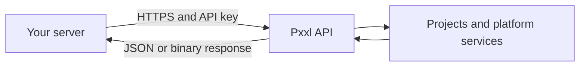

Use the API when an SDK is unavailable for your language or you need direct control over requests.

```text
https://server.pxxl.app/api/v3
```

## First request

```bash
curl https://server.pxxl.app/api/v3/cli/whoami \
  --header "Authorization: Bearer $PXXL_API_KEY" \
  --header "Accept: application/json"
```

```json
{
  "success": true,
  "user": { "id": "user_123", "email": "developer@example.com" },
  "authMethod": "api_key",
  "apiKeyScope": "all",
  "apiKeyPermission": "read_write",
  "teamId": "team_123"
}
```

## Request formats

| Content | Format |
| --- | --- |
| Most request bodies | `application/json` |
| Source and asset uploads | `multipart/form-data` |
| Downloads | Binary response body |
| MCP | JSON-RPC 2.0 at the separate MCP endpoint |



Every resource page shows its accepted parameters, example request, success response, and possible action result.

<Note>
  MCP uses `https://mcp.pxxl.app/mcp`. Do not append it to the REST API base URL.
</Note>
