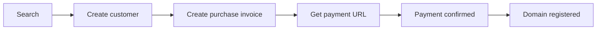

## Purchase flow



## Search for a domain

<ParamField body="query" type="string" required>
  Full domain or search term.
</ParamField>

<ParamField body="type" type="string">
  Optional TLD category filter.
</ParamField>

```ts
const result = await pxxl.domains.search({ query: "pxxl.cv" });
```

```json
{
  "query": "pxxl.cv",
  "count": 1,
  "latency": 84,
  "cached": false,
  "results": [
    {
      "domain": "pxxl.cv",
      "available": true,
      "isPremium": false,
      "tld": ".cv",
      "registerDollar": 19,
      "registerNaira": 30000,
      "renewDollar": 19,
      "minimumPeriod": 1,
      "maxDuration": 10
    }
  ]
}
```

### Search and catalog operations

| Operation | Node.js | Parameters | Returns |
| --- | --- | --- | --- |
| Search domains | `domains.search(input)` | `query`, `type?` | `{ query, results, count, latency?, cached? }` |
| Availability | `domains.availability(domain)` | Domain name | Availability and price details |
| List TLDs | `domains.listTLDs()` | None | `{ tlds, count }` |
| Get TLD | `domains.getTLD(tld)` | TLD such as `.com` | `{ tld }` |
| Popular TLDs | `domains.popularTLDs()` | None | `{ tlds, count }` |
| Search TLDs | `domains.searchTLDs(query)` | Search text | `{ tlds, count, query }` |
| TLD types | `domains.types()` | None | TLD category collection |
| TLDs by type | `domains.tldsByType(type)` | TLD category | Matching TLD collection |
| DNS lookup | `domains.dnsLookup(domain, type?)` | Domain, record type? | `{ domain, nameservers, records, status }` |
| Bulk DNS lookup | `domains.bulkDNSLookup(domains)` | Domain array | `{ results, count }` |
| Verify registration | `domains.verifyRegistration(domain)` | Domain name | `{ domain }` with registration state |
| List add-ons | `domains.addons(input?)` | `type?` | `{ addons, count }` |
| Get add-on | `domains.addon(id)` | Add-on ID | `{ addon }` |

## Create a customer

<ParamField body="firstName" type="string" required>
  Registrant first name.
</ParamField>

<ParamField body="lastName" type="string" required>
  Registrant last name.
</ParamField>

<ParamField body="email" type="string" required>
  Registrant email address.
</ParamField>

<ParamField body="phone" type="string" required>
  Registrant phone number.
</ParamField>

<ParamField body="address1" type="string" required>
  Primary street address.
</ParamField>

<ParamField body="city" type="string" required>
  City.
</ParamField>

<ParamField body="state" type="string" required>
  State or region.
</ParamField>

<ParamField body="postalCode" type="string" required>
  Postal code.
</ParamField>

<ParamField body="country" type="string" required>
  Country code.
</ParamField>

```ts
const customer = await pxxl.customers.create({
  firstName: "Robin",
  lastName: "Developer",
  email: "robin@example.com",
  phone: "+2348000000000",
  address1: "1 Example Street",
  city: "Lagos",
  state: "Lagos",
  postalCode: "100001",
  country: "NG",
});
```

```json
{
  "id": 248,
  "firstName": "Robin",
  "lastName": "Developer",
  "email": "robin@example.com",
  "phone": "+2348000000000",
  "address1": "1 Example Street",
  "city": "Lagos",
  "state": "Lagos",
  "postalCode": "100001",
  "country": "NG",
  "isDefault": false,
  "createdAt": "2026-08-17T08:00:00Z"
}
```

### Customer operations

| Operation | Node.js | Parameters | Returns |
| --- | --- | --- | --- |
| Create | `customers.create(input)` | Customer fields above | Customer object |
| List | `customers.list()` | None | `{ customers, count }` |
| Get | `customers.get(id)` | Customer ID | Customer object |
| Update | `customers.update(id, input)` | Any editable customer field | Updated customer |
| Delete | `customers.delete(id)` | Customer ID | No value |

## Purchase domains

<ParamField body="domains" type="array" required>
  Domains to purchase.
</ParamField>

<ParamField body="domains[].domainName" type="string" required>
  Full domain name.
</ParamField>

<ParamField body="domains[].years" type="number" default="1">
  Registration duration.
</ParamField>

<ParamField body="domains[].addons" type="array">
  Add-ons in the form `{ id }`.
</ParamField>

<ParamField body="domains[].nameservers" type="string[]">
  Optional custom nameservers.
</ParamField>

<ParamField body="customerId" type="string | number">
  Existing customer used for registration.
</ParamField>

<ParamField body="contact" type="object">
  Inline registrant contact when no customer ID is used.
</ParamField>

<ParamField body="address" type="object">
  Inline registrant address.
</ParamField>

<ParamField body="currency" type="NGN | USD" default="NGN">
  Checkout currency.
</ParamField>

<ParamField body="teamId" type="string">
  Team that owns the purchase.
</ParamField>

<Tabs>
  <Tab title="Node.js">
    ```ts
    const purchase = await pxxl.domains.purchase({
      customerId: customer.id,
      domains: [{ domainName: "example.com", years: 1 }],
      currency: "USD",
    });

    const checkout = await pxxl.invoices.paymentUrl(
      purchase.invoiceId,
      "USD",
    );
    ```
  </Tab>
  <Tab title="Go">
    ```go
    purchase, err := client.PurchaseDomain(ctx, map[string]any{
      "customerId": customerID,
      "domains": []map[string]any{{"domainName": "example.com", "years": 1}},
      "currency": "USD",
    })
    checkout, err := client.GetPaymentURL(ctx, invoiceID, "USD", "")
    ```
  </Tab>
  <Tab title="Python">
    ```python
    purchase = client.purchase_domain({
        "customerId": customer["id"],
        "domains": [{"domainName": "example.com", "years": 1}],
        "currency": "USD",
    })
    checkout = client.get_payment_url(purchase["invoiceId"], "USD")
    ```
  </Tab>
  <Tab title="Rust">
    ```rust
    let purchase = client.purchase_domain(json!({
        "customerId": customer["id"],
        "domains": [{"domainName": "example.com", "years": 1}],
        "currency": "USD"
    })).await?;
    let checkout = client.get_payment_url(invoice_id, Some("USD"), None).await?;
    ```
  </Tab>
</Tabs>

**Purchase response**

```json
{
  "invoiceId": "inv_123",
  "invoice": {
    "id": "inv_123",
    "status": "pending",
    "currency": "USD",
    "grandTotal": 19,
    "expiresAt": "2026-08-18T08:00:00Z"
  },
  "computedTotal": 19,
  "taxAmount": 0,
  "grandTotal": 19,
  "currency": "USD",
  "domains": [{ "domainName": "example.com", "years": 1 }],
  "domainErrors": []
}
```

**Payment URL response**

```json
{
  "paymentUrl": "https://checkout.example/pxxl/inv_123",
  "checkoutUrl": "https://checkout.example/pxxl/inv_123",
  "reference": "pxxl_inv_123",
  "invoiceId": "inv_123",
  "currency": "USD",
  "paymentUrlExpiresAt": "2026-08-18T08:00:00Z"
}
```

## Connect a domain

<ParamField body="domain" type="string" required>
  Hostname to connect.
</ParamField>

<ParamField body="projectId" type="string" required>
  Project that receives traffic.
</ParamField>

<ParamField body="serviceAlias" type="string">
  Service target for a multi-service project.
</ParamField>

<ParamField body="servicePort" type="number">
  Service port when the route needs an explicit target.
</ParamField>

<ParamField body="alias" type="boolean" default="false">
  Marks this hostname as an alias route.
</ParamField>

```ts
const connected = await pxxl.domains.connect({
  domain: "api.example.com",
  projectId: "proj_123",
  serviceAlias: "api",
});
```

```json
{
  "error": false,
  "domainId": "dom_123",
  "domain": { "name": "api.example.com", "status": "pending_dns" },
  "serviceAlias": "api",
  "expectedARecordIp": "203.0.113.10",
  "routeStatus": "pending"
}
```

### Connected domain operations

| Operation | Node.js | Parameters | Returns |
| --- | --- | --- | --- |
| List owned | `domains.listOwned(teamId?)` | `teamId?` | `{ domains, total?, success? }` |
| Get | `domains.get(id, teamId?)` | Domain ID, `teamId?` | Domain detail |
| Check | `domains.check(domain, teamId?)` | Domain name, `teamId?` | Availability or connection status |
| Stats | `domains.stats(domain, input?)` | `timeframe?`, `teamId?` | Domain analytics |
| Connect | `domains.connect(input)` | Fields above | Connected domain result |
| Connect many | `domains.connectMany(inputs)` | Connection array | `{ accepted, rejected, attempted }` |
| Update | `domains.update(id, input)` | HTTPS, websocket, project, proxy rule fields | Updated domain result |
| Verify | `domains.verify(input)` | `domain`, `projectId`, `teamId?` | DNS verification result |
| Remove | `domains.remove(domain, input?)` | `projectId?`, `teamId?` | Action result |
| Resync | `domains.resync(domain, input?)` | `teamId?` | Route resync result |
| Connection status | `domains.zoneStatus(id, teamId?)` | Domain ID, `teamId?` | DNS, proxy, and SSL status |
| Activate | `domains.activate(id, teamId?)` | Domain ID, `teamId?` | Activation result |
| Certificate | `domains.downloadCertificate(id, teamId?)` | Domain ID, `teamId?` | Binary certificate bundle |

Bulk connect keeps partial success visible:

```json
{
  "accepted": [{ "domainId": "dom_123", "domain": { "name": "app.example.com" } }],
  "rejected": [
    {
      "domain": "overflow.example.com",
      "status": 403,
      "message": "Your current plan domain limit has been reached.",
      "details": { "code": "DOMAIN_LIMIT_EXCEEDED", "limit": 5, "used": 5 }
    }
  ],
  "attempted": 2
}
```

## DNS records and nameservers

<ParamField body="type" type="string" required>
  `A`, `AAAA`, `CNAME`, `TXT`, `MX`, or another supported record type.
</ParamField>

<ParamField body="name" type="string" required>
  Record name. Use `@` for the apex.
</ParamField>

<ParamField body="value" type="string" required>
  Record value.
</ParamField>

<ParamField body="ttl" type="number">
  Time to live in seconds.
</ParamField>

<ParamField body="priority" type="number">
  Priority for records such as `MX`.
</ParamField>

```ts
const result = await pxxl.domains.upsertDNSRecord("dom_123", {
  type: "A",
  name: "@",
  value: "203.0.113.10",
  ttl: 300,
});
```

```json
{
  "error": false,
  "records": [
    { "id": "rec_123", "type": "A", "name": "@", "value": "203.0.113.10", "ttl": 300 }
  ]
}
```

| Operation | Node.js | Parameters | Returns |
| --- | --- | --- | --- |
| List records | `domains.dnsRecords(id, teamId?)` | Domain ID, `teamId?` | `{ records }` |
| Create record | `domains.upsertDNSRecord(id, input)` | Record fields above | Updated record collection |
| Replace records | `domains.replaceDNSRecords(id, input)` | `recordId?` or `records[]` | Updated record collection |
| Delete record | `domains.deleteDNSRecord(id, input)` | `recordId`, `zoneId?`, `teamId?` | Updated record collection or action result |
| Change logs | `domains.changeLogs(id, teamId?)` | Domain ID, `teamId?` | DNS change history |
| Roll back | `domains.rollbackDNSChange(id, logId, teamId?)` | Domain ID and log ID | Restored records |
| Set nameservers | `domains.updateNameservers(id, nameservers, teamId?)` | Nameserver array | Nameserver state |
| Reset nameservers | `domains.resetNameservers(id, teamId?)` | Domain ID | Nameserver state |
| Verify nameservers | `domains.verifyNameservers(id, teamId?)` | Domain ID | Verification result |

## Invoices and payments

| Operation | Node.js | Parameters | Returns |
| --- | --- | --- | --- |
| Domain invoices | `invoices.list(teamId?)` | `teamId?` | `{ invoices, error? }` |
| Domain invoice | `invoices.get(id, teamId?)` | Invoice ID, `teamId?` | `{ invoice, registrations?, grandTotal?, error? }` |
| Payment URL | `invoices.paymentUrl(id, currency?, teamId?)` | Invoice ID, `NGN | USD`, `teamId?` | Payment URL object shown above |
| Pay | `invoices.pay(id, teamId?)` | Invoice ID, `teamId?` | Payment URL object |
| Bachs checkout | `invoices.bachsPay(id, input?)` | Currency and payment method fields | Checkout result |
| Polar checkout | `invoices.polarPay(id, teamId?)` | Invoice ID, `teamId?` | Checkout result |
| Cancel | `invoices.cancel(id, teamId?)` | Invoice ID, `teamId?` | Action result |
| Purchased domains | `invoices.purchasedDomains()` | None | `{ domains, count }` |
| Unified invoices | `billing.list(input?)` | `status?`, `teamId?` | `{ invoices, count, error? }` |
| Unified invoice | `billing.get(id, teamId?)` | Invoice ID, `teamId?` | Invoice detail |
| Create invoice | `billing.create(input)` | `domainOrderId` | Invoice detail |
| Payment link | `billing.paymentLink(id)` | Invoice ID | `{ paymentUrl?, authorizationUrl?, reference?, invoiceId? }` |

Invoice objects include totals for their currency, status, payment URL, expiry, and payment timestamps.

```json
{
  "id": "inv_123",
  "status": "pending",
  "type": "domain_registration",
  "currency": "USD",
  "total": 19,
  "taxAmount": 0,
  "grandTotal": 19,
  "paymentUrl": null,
  "expiresAt": "2026-08-18T08:00:00Z",
  "paidAt": null
}
```
