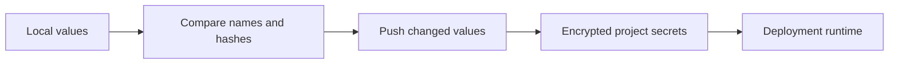

Pxxl returns names and metadata for stored secrets. It does not return secret values from list calls.



## Variable input

<ParamField body="projectId" type="string" required>
  Project receiving the variables.
</ParamField>

<ParamField body="vars" type="array" required>
  Array of variable objects.
</ParamField>

<ParamField body="vars[].key" type="string" required>
  Environment variable name.
</ParamField>

<ParamField body="vars[].value" type="string" required>
  Value encrypted by Pxxl.
</ParamField>

<ParamField body="vars[].isSecret" type="boolean" default="true">
  Marks the value as sensitive.
</ParamField>

<ParamField body="global" type="boolean" default="false">
  Applies the variables to every service in the project.
</ParamField>

<ParamField body="replace" type="boolean" default="false">
  Removes remote keys missing from `vars` instead of merging.
</ParamField>

## Compare variables

<Tabs>
  <Tab title="Node.js">
    ```ts
    const vars = [
      { key: "API_URL", value: "https://api.example.com", isSecret: false },
      { key: "API_TOKEN", value: process.env.API_TOKEN!, isSecret: true },
    ];

    const diff = await pxxl.env.diff("proj_123", vars);
    ```
  </Tab>
  <Tab title="Go">
    ```go
    input := map[string]any{"vars": []map[string]any{
      {"key": "API_URL", "value": "https://api.example.com", "isSecret": false},
    }}
    diff, err := client.DiffProjectEnv(ctx, "proj_123", false, input)
    ```
  </Tab>
  <Tab title="Python">
    ```python
    values = {"vars": [
        {"key": "API_URL", "value": "https://api.example.com", "isSecret": False}
    ]}
    diff = client.diff_project_env("proj_123", values)
    ```
  </Tab>
  <Tab title="Rust">
    ```rust
    let values = json!({"vars": [
        {"key": "API_URL", "value": "https://api.example.com", "isSecret": false}
    ]});
    let diff = client.diff_project_env("proj_123", false, values).await?;
    ```
  </Tab>
</Tabs>

**Returns**

```json
{
  "success": true,
  "projectId": "proj_123",
  "scope": "project",
  "counts": { "same": 1, "changed": 1, "missingRemote": 0, "missingLocal": 0 },
  "diff": [
    {
      "key": "API_TOKEN",
      "status": "changed",
      "local": true,
      "remote": true,
      "same": false,
      "localHash": "sha256:...",
      "remoteHash": "sha256:..."
    }
  ]
}
```

## Push variables

```ts
const result = await pxxl.env.push("proj_123", vars, {
  global: false,
  replace: false,
});
```

```json
{
  "success": true,
  "projectId": "proj_123",
  "scope": "project",
  "created": 1,
  "updated": 1,
  "deleted": 0
}
```

## Environment operations

| Operation | Node.js | Parameters | Returns |
| --- | --- | --- | --- |
| List | `env.list(projectId, options?)` | `global?` | Variable names and metadata |
| Diff | `env.diff(projectId, vars, options?)` | `vars`, `global?` | Diff object shown above |
| Push | `env.push(projectId, vars, options?)` | `vars`, `global?`, `replace?` | Applied change counts |

<Warning>
  `replace: true` removes remote keys that are not in the submitted array. Run `diff` first.
</Warning>
