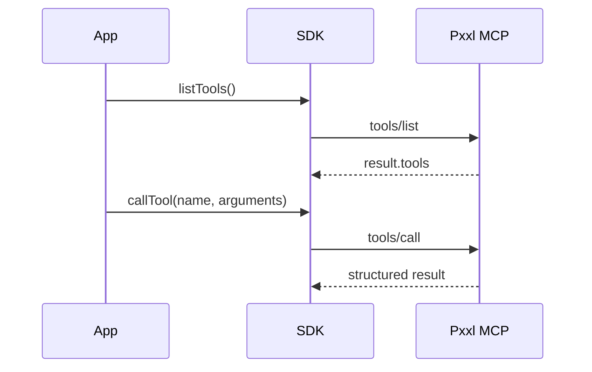

The default endpoint is `https://mcp.pxxl.app/mcp`. MCP uses JSON-RPC 2.0 and returns the inner `result` through the SDK.



## MCP operations

| Operation | Node.js | Parameters | Returns |
| --- | --- | --- | --- |
| Initialize | `mcp.initialize()` | None | Protocol version, capabilities, and server info |
| Ping | `mcp.ping()` | None | Empty successful result |
| List tools | `mcp.listTools()` | None | Tool definition array |
| Call tool | `mcp.callTool(name, arguments?)` | Tool name and arguments | MCP tool result |
| List resources | `mcp.listResources()` | None | Resource definition array |
| Read resource | `mcp.readResource(uri)` | Resource URI | MCP resource contents |
| Raw RPC | `mcp.rpc(method, params?)` | JSON-RPC method and params | Inner JSON-RPC result |

## List tools

<Tabs>
  <Tab title="Node.js">
    ```ts
    const tools = await pxxl.mcp.listTools();
    ```
  </Tab>
  <Tab title="Go">
    ```go
    result, err := client.MCP(ctx, "", "tools/list", map[string]any{})
    tools := result["tools"]
    ```
  </Tab>
  <Tab title="Python">
    ```python
    result = client.mcp_rpc("tools/list")
    tools = result["tools"]
    ```
  </Tab>
  <Tab title="Rust">
    ```rust
    let result = client.mcp_rpc("tools/list", json!({}), None).await?;
    let tools = &result["tools"];
    ```
  </Tab>
</Tabs>

```json
[
  {
    "name": "projects_list",
    "description": "List projects available to this key.",
    "inputSchema": {
      "type": "object",
      "properties": { "limit": { "type": "integer" } }
    }
  }
]
```

## Call a tool

<ParamField body="name" type="string" required>
  Tool name returned by `listTools()`.
</ParamField>

<ParamField body="arguments" type="object" default="{}">
  Arguments validated against the tool input schema.
</ParamField>

```ts
const result = await pxxl.mcp.callTool("projects_list", { limit: 10 });
```

```json
{
  "content": [
    {
      "type": "text",
      "text": "{\"projects\":[],\"total\":0}"
    }
  ],
  "structuredContent": {
    "projects": [],
    "total": 0
  },
  "isError": false
}
```

MCP errors can arrive as a JSON-RPC error or as `isError: true` inside a tool result. The SDK throws for JSON-RPC errors. Check `isError` for tool-level failures.
