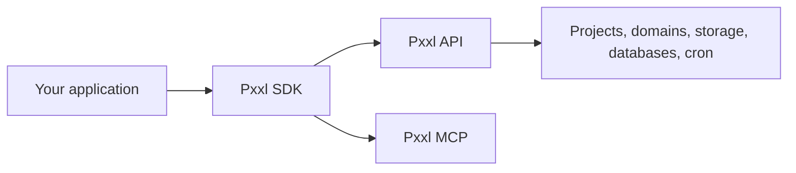

The Pxxl SDK covers projects, deployments, environment variables, domains, billing, CDN, Storage, databases, cron jobs, analytics, teams, and MCP.



## Install

<Tabs>
  <Tab title="Node.js">
    ```bash
    npm install @pxxlapp/pxxl
    ```
  </Tab>
  <Tab title="Go">
    ```bash
    go get github.com/pxxlspace/pxxlspace/sdks/go/pxxl@latest
    ```
  </Tab>
  <Tab title="Python">
    ```bash
    pip install pxxl
    ```
  </Tab>
  <Tab title="Rust">
    ```bash
    cargo add pxxl
    ```
  </Tab>
</Tabs>

## Create a client

<Tabs>
  <Tab title="Node.js">
    ```ts
    import { Pxxl } from "@pxxlapp/pxxl";

    const pxxl = new Pxxl({
      apiKey: process.env.PXXL_API_KEY,
      teamId: process.env.PXXL_TEAM_ID,
    });
    ```
  </Tab>
  <Tab title="Go">
    ```go
    client, err := pxxl.NewClient(os.Getenv("PXXL_API_KEY"))
    if err != nil { log.Fatal(err) }
    ```
  </Tab>
  <Tab title="Python">
    ```python
    import os
    from pxxl import PxxlClient

    client = PxxlClient(
        api_key=os.environ["PXXL_API_KEY"],
        team_id=os.getenv("PXXL_TEAM_ID"),
    )
    ```
  </Tab>
  <Tab title="Rust">
    ```rust
    let client = PxxlClient::new(std::env::var("PXXL_API_KEY")?)?
        .with_team_id(std::env::var("PXXL_TEAM_ID").unwrap_or_default());
    ```
  </Tab>
</Tabs>

<Note>
  Keep API keys on the server. Do not expose them in browser code.
</Note>
