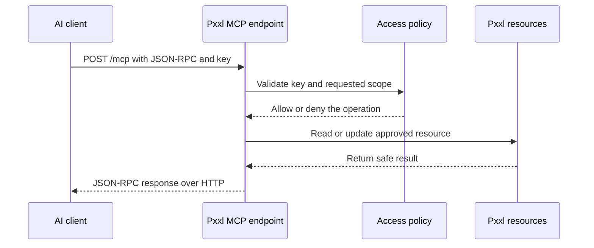

Create a connection from **MCP**. Choose the client, name the connection, select its workspace, and generate a key. Pxxl shows the raw key once, so save it in the client's secret storage or a server-side secret manager.

## Client configuration

```json
{
  "mcpServers": {
    "pxxl": {
      "url": "https://mcp.pxxl.app/mcp",
      "headers": {
        "Authorization": "Bearer YOUR_MCP_KEY"
      }
    }
  }
}
```

For a sandbox connection, use `https://sandbox-mcp.pxxl.app/mcp`. Never commit the key or put it in browser code.

## Direct HTTP request

MCP clients send JSON-RPC requests to the endpoint:

```bash
export PXXL_MCP_KEY='replace-with-your-key'

curl https://mcp.pxxl.app/mcp \
  -H "Authorization: Bearer $PXXL_MCP_KEY" \
  -H "Content-Type: application/json" \
  -H "MCP-Protocol-Version: 2025-11-25" \
  --data '{"jsonrpc":"2.0","id":1,"method":"tools/list","params":{}}'
```

Authenticate with `Authorization: Bearer YOUR_MCP_KEY` or `X-Pxxl-MCP-Key: YOUR_MCP_KEY`.

## HTTP transport

- `POST /mcp` handles initialization, tools, resources, prompts, and task requests.
- `GET /mcp` can open an event stream when the client requests `text/event-stream`.
- `OPTIONS /mcp` handles browser preflight requests.

The client handles JSON-RPC details for you. The important part is that the key is sent as an HTTP header on every request.

## Connection flow



If the client is not receiving tools, reconnect it and let it run `initialize` and `tools/list` again.
