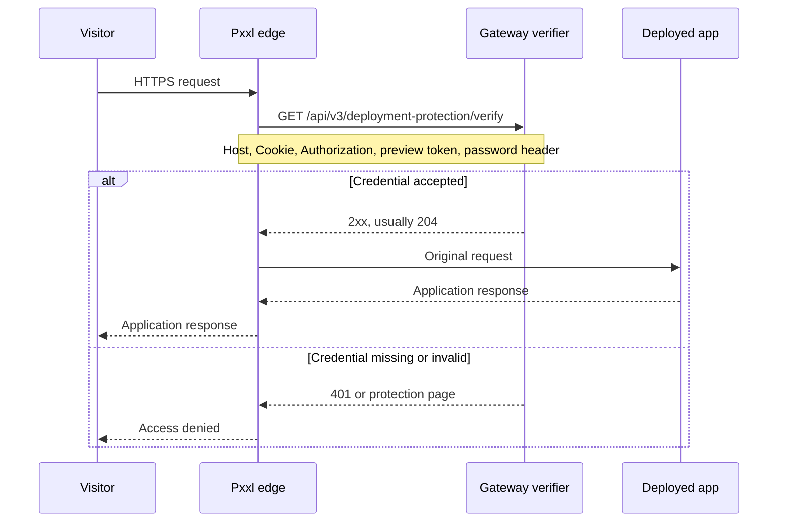

Password Protection adds a shared access gate at the Pxxl edge. Visitors must pass it before their request reaches your deployed application.

It is useful for previews, client review links, internal tools, and staging applications. Your application does not need a new route or middleware.

<Frame caption="Project Protection lets you choose the protected hostnames and save a shared visitor password.">
  
</Frame>

## Configure protection

<Steps>
  <Step title="Open Project Protection">
    Open the project, choose **Settings**, and select **Project Protection**.
  </Step>
  <Step title="Turn protection on">
    Enable **Password protection**.
  </Step>
  <Step title="Choose the scope">
    Select **Preview only** for Pxxl preview hostnames, or **Full project** for the project domains, custom domains, assets, and APIs.
  </Step>
  <Step title="Save the password">
    Enter the shared visitor password and select **Save Protection**. Pxxl updates the active edge routes after saving.
  </Step>
</Steps>

## How a protected request works

Protection runs before the deployed service is selected. The application only receives the original request after the edge check succeeds.



The flow is:

1. The dashboard saves the protection setting. The password is hashed and stored securely, and the project route is updated.
2. The route controller adds a `forward_auth` check to the protected hostname and publishes the change through the route store.
3. The edge makes a small `GET` request to the Gateway verifier. It forwards the request headers needed to identify the host and credential. The original request body is not sent to the verifier.
4. The verifier resolves the host to a project, checks the selected scope, and compares the credential with the stored hash.
5. Any successful `2xx` response allows the original request to continue. A denied response stops the request before the app is reached.

The password is never passed to the application as an application credential. Pxxl removes `X-Pxxl-Protection-Password` from the request before forwarding the request upstream.

## Send the password from server-side code

For server-to-server requests, send the password in `X-Pxxl-Protection-Password`:

```bash
curl --fail-with-body \
  -H "X-Pxxl-Protection-Password: $PXXL_SITE_PASSWORD" \
  https://your-domain.com/api/health
```

The same works from a server-side Node.js process:

```js
const response = await fetch("https://your-domain.com/api/health", {
  headers: {
    "X-Pxxl-Protection-Password": process.env.PXXL_SITE_PASSWORD,
  },
});

if (!response.ok) {
  throw new Error(`Pxxl returned ${response.status}`);
}
```

Use this header only on a trusted server. Do not put the password in frontend JavaScript, a URL, a query string, or a client-visible configuration value.

The header is for Pxxl's verifier. Your application should not depend on receiving it.

## Browser login and the session cookie

Normal browser navigation does not let a visitor attach a custom header to the first page request. When the browser is not already authorized, Pxxl serves a small password page.

<Frame caption="Visitors see the Pxxl Edge password page before the protected application is served.">
  
</Frame>

When the visitor submits the form:

1. The edge sends the form request to the Gateway verifier.
2. The verifier checks the `password` form field.
3. A successful login returns a redirect to the original same-site path and sets `x-pxxl-protection-session`.
4. The browser sends that `HttpOnly`, `Secure` cookie on later requests. The edge forwards it to the verifier.

The session lasts 12 hours. It is tied to the protected host and the saved password hash. Changing the password makes existing sessions invalid.

## Headers used by the edge check

Pxxl copies these headers into the verifier request when they are present:

| Header | What it is used for |
| --- | --- |
| `Host` or `X-Forwarded-Host` | Finds the project and determines which scope applies. |
| `Cookie` | Checks an existing browser protection session. |
| `X-Pxxl-Protection-Password` | Checks the shared password for trusted server requests. |
| `Authorization` | Supports Basic Auth, bearer tokens, and platform identity checks. |
| `X-Pxxl-Preview-Token` | Supports token-based preview protection. |

These headers are inputs to the edge check, not a contract for the deployed service. The verifier response has no trusted identity headers for the application to consume.

## HTTPS and HTTP

Pxxl public routes redirect HTTP to HTTPS by default. The protection check happens at the edge on the HTTPS route, before the request is sent to the application.

Use HTTPS whenever you send a protection password. If a custom route deliberately allows plain HTTP, the password header and form submission can be exposed in transit and should not be used there.

## Preview-only and full-project scope

| Scope | What it protects |
| --- | --- |
| **Preview only** | Pxxl preview and default project hostnames. Custom domains are left outside this project-level gate. |
| **Full project** | The project's default domains, custom domains, assets, and APIs. |

The route is rebuilt for each active hostname when the setting changes. If an edge route is temporarily unavailable, the dashboard reports that the protection was saved while route synchronization is pending.

## Other protection modes

The protection record also supports token, email, and team checks for platform integrations. Those modes use `X-Pxxl-Preview-Token` or bearer identity headers instead of a shared visitor password. The dashboard flow above documents the shared-password mode.

## Configure through the API

The dashboard uses these authenticated project endpoints:

```text
GET /api/v3/projects/:id/protection
PUT /api/v3/projects/:id/protection
```

An update can include `enabled`, `mode`, `previewOnly`, and `secret`. Pxxl stores only a secure hash of the secret. The current `@pxxlapp/pxxl` SDK and CLI do not expose project protection methods, so use the dashboard or the authenticated API endpoints for this setting.

## What it does not replace

Password Protection is one shared gate. It does not provide per-user accounts, roles, audit history, or application authorization. Keep user authentication inside the application when different users need different access.

<Warning>
  Do not place a production database password, API key, or other secret in the visitor password field. Use [Secrets](/projects/secrets) for values the application needs at build or runtime.
</Warning>
