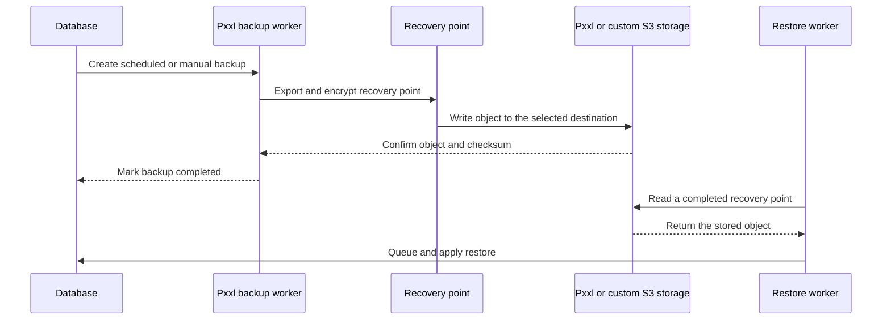

Database backups are configured from a database's **Backup** section. Paid database plans can create daily encrypted recovery points and manual backups. The retention period comes from the plan.

## Connection

Choose one destination:

| Destination | What it means |
| --- | --- |
| **Pxxl managed storage** | Pxxl keeps recovery points in private platform storage. These objects are separate from your user Storage buckets. |
| **Custom S3-compatible storage** | Pxxl writes recovery points to a bucket that your team controls. |

For a custom S3 destination, enter:

| Field | What to enter |
| --- | --- |
| **Endpoint** | A valid public HTTPS S3 API endpoint. |
| **Bucket** | The bucket that receives the recovery points. |
| **Region** | The provider region, or `auto` where supported. |
| **Prefix** | An optional folder-like path. |
| **Access key ID** | A key with the required bucket permissions. |
| **Secret access key** | The matching secret. |

Pxxl checks the bucket with the supplied credentials before saving the destination. Access keys and secrets are stored in protected credential storage, not in the database as plaintext.

## Backup flow



Changing the destination creates a new destination record. A completed backup keeps the destination and credentials that were used when its object was written, so changing settings does not move older recovery points.

## Configure backups

<Steps>
  <Step title="Open the database">
    Select a database, then open **Backup**.
  </Step>
  <Step title="Choose the destination">
    Select Pxxl-managed storage or custom S3-compatible storage.
  </Step>
  <Step title="Enter and verify the destination">
    For custom S3, enter the endpoint, bucket, region, prefix, access key, and secret key. Pxxl verifies that the bucket can be reached.
  </Step>
  <Step title="Enable daily backups">
    Turn on daily backups and save. You can also create a recovery point immediately from **Recovery points**.
  </Step>
</Steps>

## AWS CLI preflight

Use the AWS CLI to confirm that a restricted key can see the bucket and, if you choose, write a test object:

```bash
export AWS_ACCESS_KEY_ID='replace-with-access-key'
export AWS_SECRET_ACCESS_KEY='replace-with-secret-key'
export AWS_REGION='us-east-1'
export PXXL_BACKUP_BUCKET='replace-with-bucket'
export PXXL_BACKUP_PREFIX='pxxl-backups/my-database'
export PXXL_ENDPOINT='https://s3.us-east-1.amazonaws.com'

aws s3api head-bucket \
  --bucket "$PXXL_BACKUP_BUCKET" \
  --endpoint-url "$PXXL_ENDPOINT"

aws s3api put-object \
  --bucket "$PXXL_BACKUP_BUCKET" \
  --key "$PXXL_BACKUP_PREFIX/_connection-test" \
  --body /dev/null \
  --endpoint-url "$PXXL_ENDPOINT"

aws s3api delete-object \
  --bucket "$PXXL_BACKUP_BUCKET" \
  --key "$PXXL_BACKUP_PREFIX/_connection-test" \
  --endpoint-url "$PXXL_ENDPOINT"
```

The last two commands write to and delete from the bucket. Use a test prefix and run them only when you intend to make that change. For AWS S3, use the bucket's region. For Cloudflare R2, use the account endpoint and `AWS_REGION=auto`. For MinIO, use its public HTTPS endpoint and configured region.

## Required bucket permissions

Pxxl needs to verify the bucket, write new recovery points, read them for download and restore, and delete objects when a recovery point is removed or expires.

```json
{
  "Version": "2012-10-17",
  "Statement": [
    {
      "Sid": "InspectBackupBucket",
      "Effect": "Allow",
      "Action": ["s3:ListBucket", "s3:GetBucketLocation"],
      "Resource": "arn:aws:s3:::YOUR_BUCKET",
      "Condition": {
        "StringLike": {
          "s3:prefix": ["YOUR_PREFIX", "YOUR_PREFIX/*"]
        }
      }
    },
    {
      "Sid": "ManagePxxlBackups",
      "Effect": "Allow",
      "Action": ["s3:GetObject", "s3:PutObject", "s3:DeleteObject"],
      "Resource": "arn:aws:s3:::YOUR_BUCKET/YOUR_PREFIX/*"
    }
  ]
}
```

If you only need to create backups and never download, restore, or remove them from Pxxl, your policy can be narrower. The full set supports the actions available in the Backup section.

## Recovery points

Each recovery point moves through a small lifecycle:

| Status | Meaning |
| --- | --- |
| **Queued** | Pxxl accepted the backup request. |
| **Running** | The worker is exporting and writing the recovery point. |
| **Completed** | The object is available for download or restore. |
| **Failed** | The worker could not create or store the recovery point. |
| **Expired** | The recovery point passed its retention period and its object was removed. |

Only completed recovery points can be restored. A restore is queued separately and can replace the current database data. Confirm the selected recovery point before starting it and wait for the restore status before reconnecting the application.

## Monitoring and troubleshooting

When a backup fails, check the recovery point error, the destination endpoint, the bucket region, and the access key permissions. A common configuration issue is a key that can list a bucket but cannot write to the selected prefix.

If the database is healthy but a restore cannot start, check whether another backup or restore is already running. Pxxl allows one active backup and one active restore per database at a time.

For the database connection itself, return to [Managed Databases](/database/overview). For general S3-compatible setup, see [Storage](/storage/overview).
