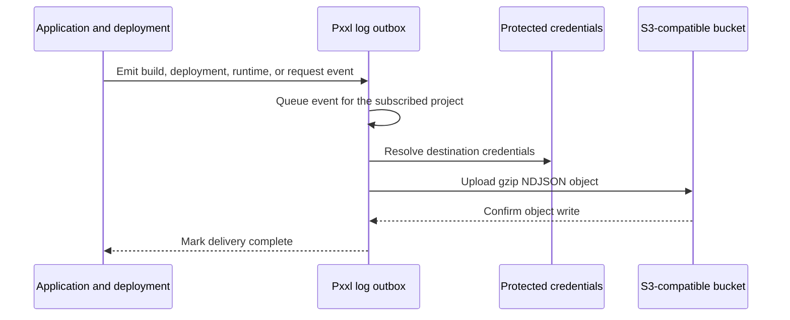

Log Drains send project output outside Pxxl for longer retention, compliance, search, or analysis. The documentation puts this feature under Storage. In the product, configure it from **Project > Settings > Log Drains**.

An account can have up to three log drains. A drain is account-owned and can be enabled for one or more projects.

## Connection

Pxxl supports two destination kinds:

| Destination | Use it for |
| --- | --- |
| **S3-compatible** | Amazon S3, Cloudflare R2, MinIO, or another compatible object store. |
| **HTTPS** | A public HTTPS endpoint that accepts Pxxl's compressed log payload. |

For S3-compatible storage, enter:

| Field | What to enter |
| --- | --- |
| **Name** | A label for the destination. |
| **Endpoint** | A public HTTPS S3 API endpoint. |
| **Bucket** | The bucket that receives log objects. |
| **Region** | The provider region, or `auto` where supported. |
| **Prefix** | An optional folder-like path such as `pxxl-logs/my-project`. |
| **Access key ID** | A restricted write key. |
| **Secret access key** | The matching secret. |

Pxxl stores credentials in protected credential storage. The database keeps only a reference to them and the non-secret destination settings.

For an HTTPS destination, enter the public URL and configure the token or headers the endpoint expects. Pxxl sends `Content-Type: application/x-ndjson`, `Content-Encoding: gzip`, and a Pxxl user agent. A configured token is sent as a Bearer token.

## S3-compatible flow



Pxxl batches events and writes objects with a time-partitioned key:

```text
PREFIX/dt=YYYY-MM-DD/<timestamp>.ndjson.gz
```

If no prefix is supplied, Pxxl uses a private drain prefix based on the drain ID. The object contains one JSON event per line after decompression. The exact event fields vary by source and can include build output, deployment events, runtime output, and HTTP activity.

## Create a drain

<Steps>
  <Step title="Prepare the destination">
    Create a dedicated bucket or prefix. Make sure the endpoint is public HTTPS and the key can write to the selected location.
  </Step>
  <Step title="Open Log Drains">
    From the project, open **Settings > Log Drains** and create a destination.
  </Step>
  <Step title="Enter the S3 settings">
    Add the endpoint, bucket, region, prefix, access key, and secret key. Select the log sources you want to export.
  </Step>
  <Step title="Test the destination">
    Use the destination test. Pxxl emits a test event and attempts an immediate delivery.
  </Step>
  <Step title="Enable the project subscription">
    Attach the drain to the project, then produce fresh output and confirm a new object appears in the bucket.
  </Step>
</Steps>

## AWS CLI preflight

Run these checks with a restricted test credential before entering the values in Pxxl:

```bash
export AWS_ACCESS_KEY_ID='replace-with-access-key'
export AWS_SECRET_ACCESS_KEY='replace-with-secret-key'
export AWS_REGION='us-east-1'
export PXXL_LOG_BUCKET='replace-with-bucket'
export PXXL_LOG_PREFIX='pxxl-logs/my-project'
export PXXL_ENDPOINT='https://s3.us-east-1.amazonaws.com'

aws s3api head-bucket \
  --bucket "$PXXL_LOG_BUCKET" \
  --endpoint-url "$PXXL_ENDPOINT"

aws s3api put-object \
  --bucket "$PXXL_LOG_BUCKET" \
  --key "$PXXL_LOG_PREFIX/_connection-test" \
  --body /dev/null \
  --endpoint-url "$PXXL_ENDPOINT"

aws s3api delete-object \
  --bucket "$PXXL_LOG_BUCKET" \
  --key "$PXXL_LOG_PREFIX/_connection-test" \
  --endpoint-url "$PXXL_ENDPOINT"
```

The write and delete commands are optional and change the bucket. Run them only in a test prefix. The Pxxl test action is the authoritative check because it validates the complete drain configuration and sends a real test event.

For Cloudflare R2, set `PXXL_ENDPOINT` to `https://ACCOUNT_ID.r2.cloudflarestorage.com` and set `AWS_REGION=auto`. For MinIO, use its public HTTPS endpoint and configured region.

## Least-privilege AWS policy

For a log-only prefix, the access key can be limited to bucket inspection and object writes. Add read or delete permissions only if your retention workflow needs them.

```json
{
  "Version": "2012-10-17",
  "Statement": [
    {
      "Sid": "InspectLogBucket",
      "Effect": "Allow",
      "Action": ["s3:ListBucket", "s3:GetBucketLocation"],
      "Resource": "arn:aws:s3:::YOUR_BUCKET",
      "Condition": {
        "StringLike": {
          "s3:prefix": ["YOUR_PREFIX", "YOUR_PREFIX/*"]
        }
      }
    },
    {
      "Sid": "WritePxxlLogs",
      "Effect": "Allow",
      "Action": ["s3:PutObject"],
      "Resource": "arn:aws:s3:::YOUR_BUCKET/YOUR_PREFIX/*"
    }
  ]
}
```

## Monitoring and failures

The drain test and project settings show whether the destination is active. Pxxl records delivery attempts in its outbox and retries failed deliveries with backoff. A delivery is marked failed after repeated attempts. A drain can become disabled after an extended failure period, so check the destination's last error and update its credentials or endpoint before enabling it again.

Use the destination's bucket lifecycle rules to expire or archive old objects. Pxxl does not use an external bucket as a replacement for the project's Live Logs view.

## HTTPS destinations

An HTTPS drain receives a compressed NDJSON request. The endpoint must use a public HTTPS hostname that does not resolve to a private, loopback, metadata, multicast, or reserved network. Pxxl follows only a small number of redirects and validates each destination again.

Your receiver should:

1. authenticate the Bearer token or configured header;
2. accept the gzip encoded body;
3. return a `2xx` response after safely storing the payload;
4. process events asynchronously if the receiver needs more time.

For application assets and signed object delivery, use the [CDN API](/api/cdn) instead. CDN storage and log-drain destinations have different jobs.
