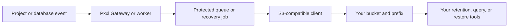

Pxxl uses object storage in two different ways:

1. **Pxxl-managed storage** keeps platform data and managed recovery points inside Pxxl.
2. **External S3-compatible storage** is a destination you control for exports such as log drains or database backups.

These paths are separate. Pxxl CDN storage is for application assets and object delivery. An S3-compatible destination is for data that Pxxl sends to a bucket owned by your team.

## Storage areas

| Area | Use it for |
| --- | --- |
| **CDN and uploads** | Application assets, uploads, and public or signed object delivery. See the [CDN API](/api/cdn). |
| **Log Drains** | Export project and deployment output to an external destination. |
| **Database backups** | Store encrypted database recovery points in Pxxl or your S3-compatible bucket. |
| **Project artifacts** | Build outputs and deployment artifacts managed by the deployment system. |

## S3-compatible providers

Pxxl can use an S3-compatible API when the feature asks for an external destination. Common providers include:

| Provider | Endpoint example |
| --- | --- |
| **Amazon S3** | `https://s3.us-east-1.amazonaws.com` |
| **Cloudflare R2** | `https://ACCOUNT_ID.r2.cloudflarestorage.com` |
| **MinIO** | Your public HTTPS MinIO endpoint. |

The endpoint must be a public HTTPS URL. Pxxl checks that it can resolve and reach the endpoint and rejects private or reserved network destinations.

## Connection

When a feature asks for an external S3 destination, provide:

| Field | Meaning |
| --- | --- |
| **Endpoint** | The provider's S3 API URL. |
| **Bucket** | The bucket Pxxl should write to. |
| **Region** | The provider region, or `auto` where supported. |
| **Prefix** | An optional folder-like path inside the bucket. |
| **Access key ID** | A restricted key for the destination. |
| **Secret access key** | The matching secret. |

Pxxl stores the access key and secret in protected credential storage. The saved secret is not returned to the dashboard after setup.

## Object flow



The exact object key depends on the feature. Log drains use time-partitioned compressed NDJSON objects. Database backups keep the object location with the recovery point so changing the destination later does not move an older backup.

## Check a destination with AWS CLI

The AWS CLI can check access before you save a destination in Pxxl. It works with AWS S3 and, with `--endpoint-url`, with other S3-compatible services.

```bash
export AWS_ACCESS_KEY_ID='replace-with-access-key'
export AWS_SECRET_ACCESS_KEY='replace-with-secret-key'
export AWS_REGION='us-east-1'
export PXXL_BUCKET='replace-with-bucket'
export PXXL_ENDPOINT='https://s3.us-east-1.amazonaws.com'

aws s3api head-bucket \
  --bucket "$PXXL_BUCKET" \
  --endpoint-url "$PXXL_ENDPOINT"

aws s3 ls "s3://$PXXL_BUCKET/" \
  --endpoint-url "$PXXL_ENDPOINT"
```

For AWS S3, use the bucket's actual region and endpoint. For Cloudflare R2 or MinIO, replace `PXXL_ENDPOINT` with the HTTPS endpoint from that provider and use the provider's region value.

The Pxxl **Test** action remains the final check because it verifies the exact destination and credentials that the feature will use.

## Keep access narrow

Use a dedicated bucket or prefix when possible. Grant only the operations required by the feature, rotate keys through the storage provider, and configure the bucket's lifecycle rules for your retention policy.

Continue to [Log Drains](/storage/log-drains) or [Database backups](/storage/database-backups) for the feature-specific flow.
